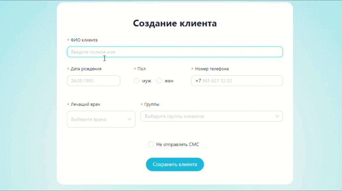

# Форма создания клиента

#### Деплой: https://clinic-client-form.vercel.app

## Стек

- React
- Redux Toolkit
- Ant Design
- Day.js

---

## Форма

#### ФИО клиента

- подгрузка вариантов с debounce и автозаполнение
- автоформатирование каждого слова с большой буквы
- удаление лишних пробелов
- валидация

#### Дата рождения

- маска
- валидация по возрасту

#### Номер телефона

- автоформатирование с +7
- маска

#### Лечащий врач

- подгрузка вариантов по апи
- подгрузка фото

#### Группы клиентов

- подгрузка вариантов по апи
- отображение описания группы при наведении на иконку информации

#### Сохранение

- валидация формы
- фейковое сохранение, объект выводится в консоль с задержкой и появляется уведомление
- лоадер на кнопке пока идет запрос
